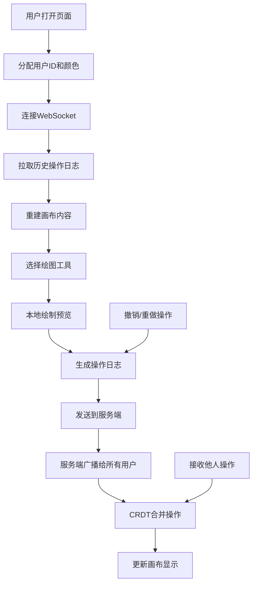

## 1. 产品概述

多人协作在线白板应用，支持团队成员实时在同一画布上进行头脑风暴、绘制图表、标注讨论。解决远程协作时无法共享白板的痛点，保证多用户操作的最终一致性。

- 主要用途：远程团队协作、在线教学、设计评审、项目规划
- 目标用户：产品团队、设计团队、教育工作者、远程办公人群
- 核心价值：实时同步、无冲突协作、操作可追溯

## 2. 核心功能

### 2.1 用户角色

| 角色 | 接入方式 | 核心权限 |
|------|----------|----------|
| 协作者 | 打开页面自动分配ID | 绘制、擦除、撤销、重做、查看他人光标 |

### 2.2 功能模块

1. **白板画布**：无限画布区域，支持缩放和平移
2. **绘图工具栏**：铅笔、直线、矩形、椭圆、文字贴纸、橡皮擦
3. **实时协作**：多人光标显示、操作实时同步
4. **历史管理**：无限层撤销/重做、操作日志同步
5. **状态持久化**：页面刷新后恢复画布内容

### 2.3 页面详情

| 页面名称 | 模块名称 | 功能描述 |
|----------|----------|----------|
| 主界面 | 顶部工具栏 | 工具选择、颜色选择、线宽选择、撤销/重做按钮 |
| 主界面 | 画布区域 | 无限画布、支持缩放平移、显示所有绘制内容 |
| 主界面 | 在线用户列表 | 显示当前在线用户及其光标颜色 |
| 主界面 | 光标层 | 实时显示其他用户的光标位置和名称 |

## 3. 核心流程

用户打开页面 → 自动分配用户ID和颜色 → 连接WebSocket → 从服务端拉取历史操作 → 重建画布 → 选择工具开始绘制 → 本地绘制并发送操作日志 → 接收其他用户操作 → CRDT合并 → 更新画布 → 支持撤销/重做 → 操作同步给所有用户。

## 4. 用户界面设计

### 4.1 设计风格

- **主色调**：深蓝色 #1e40af 作为强调色，深灰色 #1f2937 作为背景，营造专业协作氛围
- **辅助色**：每个用户分配独特的光标颜色（红色、绿色、橙色、紫色、青色等）
- **按钮风格**：圆角胶囊按钮，选中状态有明显的边框高亮
- **字体**：使用 "JetBrains Mono" 作为代码和数字字体，"Noto Sans SC" 作为中文字体
- **布局风格**：顶部固定工具栏，左侧用户列表，中央无限画布
- **视觉效果**：画布背景使用浅灰色网格纹理，添加微妙的噪点质感

### 4.2 页面设计概述

| 页面名称 | 模块名称 | UI 元素 |
|----------|----------|---------|
| 主界面 | 顶部工具栏 | 工具图标按钮、颜色选择器、线宽滑块、撤销/重做按钮、清除按钮 |
| 主界面 | 画布区域 | 无限白色画布、网格背景、绘制图形、文字贴纸 |
| 主界面 | 用户列表 | 用户头像、用户名、颜色标识、在线状态 |
| 主界面 | 光标层 | 彩色光标、用户名标签、平滑动画 |

### 4.3 响应式

- 桌面端优先设计，左侧用户列表可折叠
- 移动端适配：工具栏移至底部，用户列表改为抽屉式
- 触摸操作优化：支持双指缩放和平移

### 4.4 动效设计

- 工具按钮悬停：轻微放大和阴影加深
- 光标移动：平滑过渡动画，避免闪烁
- 撤销/重做：画布内容渐入渐出效果
- 用户加入/离开：列表项滑入滑出动画
