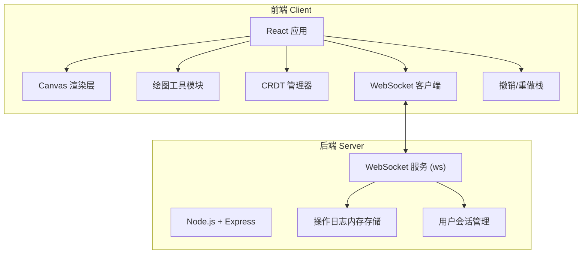
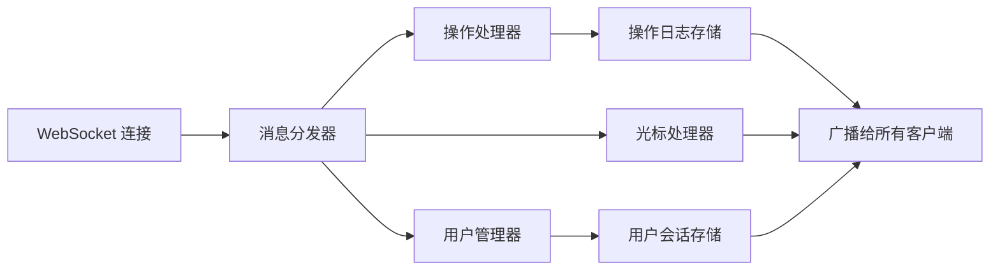

## 1. 架构设计

本项目采用前后端分离架构，通过 WebSocket 实现实时双向通信。前端负责画布渲染和用户交互，后端负责操作日志存储和广播同步。



## 2. 技术描述

- **前端**：React@18 + TypeScript + Vite + TailwindCSS@3
- **后端**：Node.js + Express@4 + ws@8 (WebSocket 库)
- **CRDT 实现**：基于操作日志的 Last-Write-Wins (LWW) 策略，结合 Lamport 时间戳
- **状态持久化**：服务端内存存储操作日志，页面刷新时重放恢复
- **初始化工具**：Vite 脚手架

## 3. 目录结构

```
├── client/                # 前端应用
│   ├── src/
│   │   ├── components/    # React 组件
│   │   ├── hooks/         # 自定义 Hooks
│   │   ├── crdt/          # CRDT 实现
│   │   ├── tools/         # 绘图工具实现
│   │   ├── types/         # TypeScript 类型定义
│   │   └── utils/         # 工具函数
│   └── package.json
├── server/                # 后端服务
│   ├── src/
│   │   ├── server.ts      # 入口文件
│   │   ├── websocket.ts   # WebSocket 处理
│   │   └── store.ts       # 内存存储
│   └── package.json
└── package.json           # 根 package.json
```

## 4. 核心数据结构

### 4.1 操作类型定义

```typescript
type ToolType = 'pencil' | 'line' | 'rect' | 'ellipse' | 'text' | 'eraser';

interface Point {
  x: number;
  y: number;
}

interface Operation {
  id: string;                    // 操作唯一ID
  userId: string;                // 用户ID
  lamport: number;               // Lamport 时间戳
  type: 'draw' | 'undo' | 'redo';
  tool: ToolType;
  points?: Point[];              // 铅笔/橡皮擦的路径点
  startPoint?: Point;            // 直线/矩形/椭圆的起点
  endPoint?: Point;              // 直线/矩形/椭圆的终点
  text?: string;                 // 文字内容
  position?: Point;              // 文字位置
  color: string;                 // 颜色
  lineWidth: number;             // 线宽
  timestamp: number;             // 时间戳
  undoOf?: string;               // 撤销的操作ID
}

interface User {
  id: string;
  name: string;
  color: string;
  cursor?: Point;
}

interface CursorMessage {
  type: 'cursor';
  userId: string;
  position: Point;
}
```

### 4.2 WebSocket 消息协议

```typescript
type MessageType = 
  | 'init'        // 初始化，拉取历史
  | 'history'     // 服务端返回历史
  | 'operation'   // 操作日志
  | 'cursor'      // 光标位置
  | 'user-join'   // 用户加入
  | 'user-leave'  // 用户离开
  | 'users'       // 当前用户列表
  | 'sync';       // 全量同步

interface WSMessage<T = any> {
  type: MessageType;
  payload: T;
}
```

## 5. API 定义

### 5.1 HTTP 接口

| 方法 | 路径 | 用途 |
|------|------|------|
| GET | /api/history | 获取完整操作历史 |
| GET | /api/users | 获取当前在线用户 |

### 5.2 WebSocket 消息流

1. 客户端连接 → 发送 `init` 消息
2. 服务端响应 `history` + `users` 消息
3. 服务端广播 `user-join` 消息给其他用户
4. 绘制时发送 `operation` 消息 → 服务端广播给所有用户
5. 移动鼠标发送 `cursor` 消息 → 服务端广播给其他用户
6. 用户断开 → 服务端广播 `user-leave` 消息

## 6. CRDT 算法设计

采用基于操作日志的 LWW (Last-Write-Wins) CRDT：

1. **Lamport 时间戳**：每个操作携带递增的逻辑时钟，保证全局偏序
2. **操作幂等性**：每个操作有唯一ID，重复接收不重复应用
3. **冲突解决**：同一位置的操作，时间戳大的获胜
4. **撤销实现**：撤销操作生成反向操作，携带 `undoOf` 字段指向原操作
5. **最终一致性**：所有客户端按相同顺序重放操作日志，结果一致

## 7. 服务端架构



## 8. 关键技术点

1. **Canvas 渲染**：使用 HTML5 Canvas 2D API，支持缩放和平移变换
2. **无限画布**：通过维护视图偏移量和缩放比例实现
3. **实时光标**：使用 DOM 元素层覆盖在 Canvas 上，通过 CSS transform 定位
4. **操作重放**：页面加载时从服务端拉取所有历史操作，按顺序重绘
5. **撤销/重做**：维护两个栈，撤销时将操作移到重做栈，同时发送撤销操作给服务端
